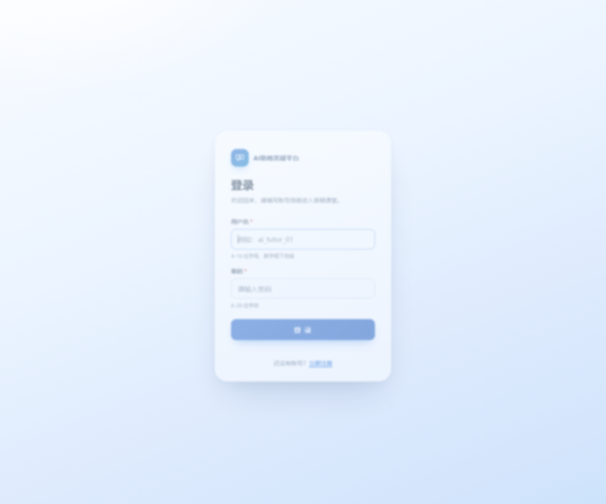
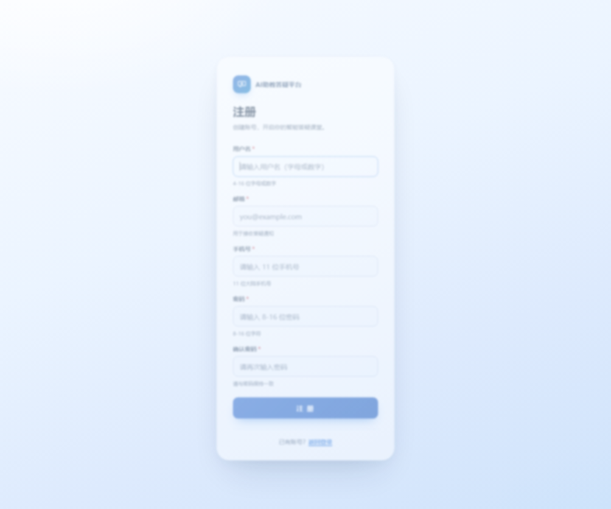

# 前端开发技术课程作业合集归档

## 作业 1

期望实现:

实际效果:

完成时间: 2026-9-10

预览地址: 

国内CDN: [https://fwork.pgigi.com/work1](https://fwork.pgigi.com/work1)

国外CDN: [https://fwork.pgg.wtf/work1](https://fwork.pgg.wtf/work1)

## 作业 2

任务: 阅读博客 HTML 代码，找出页面中错误或缺陷，填写表格（缺陷位置 / 错误描述 / 造成的影响），共定位 17 处缺陷。

文件:

- [work2/html5错误案例.html](work2/html5错误案例.html) —— 待分析页面（含下表缺陷）
- [work2/html5优化版本.html](work2/html5优化版本.html) —— 修复后的 HTML5 语义化版本
- [work2/课后任务文档.md](work2/课后任务文档.md) / [work2/index.html](work2/index.html) —— 缺陷分析文档及其网页版

完成时间: 2026-9-21

缺陷表格:

| 序号 | 缺陷位置                               | 错误描述                                                                                                                            | 造成的影响                                                                                                                       |
|------|----------------------------------------|-------------------------------------------------------------------------------------------------------------------------------------|----------------------------------------------------------------------------------------------------------------------------------|
| 1    | 第 1 行 `<html>`;                      | 缺少 HTML5 文档类型声明 `<!DOCTYPE html>`;，浏览器无法以标准模式渲染页面                                                            | 可能导致 CSS 布局错乱、盒模型计算不一致，不同浏览器下显示效果差异大                                                              |
| 2    | 第 1 行 `<html>`;                      | `<html>`; 标签缺少 lang 属性（如 lang="zh-CN"）                                                                                     | 搜索引擎无法准确识别页面语言，影响 SEO；屏幕阅读器无法正确切换发音语言，无障碍访问体验差                                         |
| 3    | 第 18-23 行 / 第 123 行 ``; 标签 | 大量使用已废弃的 ``; 标签（包括 size、color 属性）来设置文本样式                                                              | 违反 HTML5 规范，样式与结构混杂；代码可维护性差，不利于全站统一样式管理；部分浏览器可能不再支持                                  |
| 4    | 第 123 行 `
`;                  | 使用已废弃的 `
`; 标签进行居中对齐                                                                                           | `
`; 在 HTML5 中已被弃用，应使用 CSS text-align:center 或 Flexbox 实现，代码不规范，存在兼容性风险                        |
| 5    | 第 126 行 `<marquee>`;                 | 使用已废弃的 `<marquee>`; 跑马灯标签                                                                                                | `<marquee>`; 为非标准标签，已从 HTML5 规范中移除；部分现代浏览器可能不支持；影响页面可访问性（动态内容无法被屏幕阅读器稳定捕获） |
| 6    | 第 130 行 / 第 146 行 id="content"     | 页面中出现两个相同的 id="content"，id 属性值重复                                                                                    | JavaScript 中 getElementById() 只能获取第一个元素，导致脚本逻辑错误；CSS ID 选择器行为不确定；违反 HTML 规范                     |
| 7    | 第 140 行 ``; 标签                | 图片缺少 alt 属性（替代文本）                                                                                                       | 图片加载失败时无法显示说明文字；屏幕阅读器无法描述图片内容，无障碍访问不达标；影响图片 SEO                                       |
| 8    | 第 132 行 `<b>`; 标签                  | 使用 `<b>`; 标签作为文章标题，而非语义化的 `<h1>`;~`<h6>`;                                                                          | 页面缺乏正确的标题层级结构，不利于 SEO 和屏幕阅读器用户理解内容结构；`<b>`; 仅为视觉加粗，无语义                                 |
| 9    | 第 138-143 行 正文区域                 | 正文中部分段落使用 ``; 包裹，而其他段落没有，样式不统一                                                              | 正文字号不一致，阅读体验差；样式管理混乱，应统一通过 CSS .article-body p 控制                                                    |
| 10   | 第 122-159 行 整体结构                 | 页面整体使用 `
`; 布局，未使用 HTML5 语义化标签（`<header>`;、`<nav>`;、`<main>`;、`<article>`;、`<section>`;、`<footer>`; 等） | 页面结构语义不明确，搜索引擎难以理解内容层次；屏幕阅读器用户无法通过地标（landmark）快速跳转；SEO 效果不佳                       |
| 11   | 第 133-137 行 目录区域                 | 文章目录使用 ` `; 换行实现列表，而非 `<ul>`;/`<ol>`; + `<li>`; 列表结构                                                          | 结构语义缺失，屏幕阅读器无法识别为列表；样式调整困难（无法用列表样式统一控制）；可维护性差                                       |
| 12   | 第 149-153 行 评论表单                 | 表单输入控件缺少 `<label>`; 标签关联，“昵称”和“评论”为纯文本                                                                        | 点击文字无法聚焦输入框，用户体验差；屏幕阅读器无法朗读对应的标签文字，表单可访问性严重不足                                       |
| 13   | 第 149-153 行 评论表单                 | 表单缺少客户端验证（如 required 属性、maxlength 限制），也缺少防 CSRF 的隐藏字段                                                    | 用户可提交空评论或超长内容，增加服务器负担和垃圾评论风险；缺少 CSRF 防护存在安全隐患，易被跨站请求伪造攻击                       |
| 14   | 第 127 行 导航栏                       | 导航链接之间使用竖线符号作为分隔符，而非 CSS border 或 Flexbox 间隔                                                                 | 结构与表现混杂，分隔符无法通过 CSS 灵活控制样式；在无障碍阅读中竖线会被朗读出来，影响体验                                        |
| 15   | 第 33 行 / 第 126 行 marquee 样式      | CSS 中写了 .nav marquee { display: none; }，即页面中 marquee 被隐藏但仍保留在 HTML 中，属于无用代码                                 | 增加页面体积，造成代码冗余；影响代码可维护性，容易误导后续开发者                                                                 |
| 16   | 第 4 行 `<title>`;                     | 页面标题为“技术博客 - 文章详情”，但文章实际标题是“HTML5 学习笔记”，标题与内容不匹配                                                 | 影响 SEO 排名（搜索引擎依据 title 判断页面主题）；用户在浏览器标签页中无法快速识别具体文章内容                                   |
| 17   | 第 135-136 行 目录锚点                 | 目录链接 #item1、#item2 指向的锚点在正文中不存在                                                                                    | 点击目录链接无反应或跳转到错误位置，目录功能失效，用户体验差；跳转目标缺失属于功能缺陷                                           |

预览地址:

国内CDN: [https://fwork.pgigi.com/work2](https://fwork.pgigi.com/work2)

国外CDN: [https://fwork.pgg.wtf/work2](https://fwork.pgg.wtf/work2)

## 作业 3

项目名称: AI助教答疑平台 登录&注册页面

技术要点: 原生 HTML5 + 内嵌 CSS，全程零 JavaScript；`required`、`pattern`、`type="email"`、`type="tel"`、`type="password"`、`minlength/maxlength`、`placeholder`、`autofocus`、`autocomplete` 与浏览器原生约束验证；浅蓝色主题、居中卡片、移动端自适应（clamp 流式缩放）。

实际效果:

登录页:

注册页:

文件:

- [work3/login.html](work3/login.html) —— 登录页（单文件，内嵌 CSS，无 JS）
- [work3/register.html](work3/register.html) —— 注册页（单文件，内嵌 CSS，无 JS）
- [work3/课后任务文档.md](work3/课后任务文档.md) / [work3/课后任务文档.docx](work3/课后任务文档.docx) —— 课后任务文档（源 / 提交版）
- [work3/index.html](work3/index.html) —— 文档网页版（即 /work3/ 预览内容）

完成时间: 2026-9-25

预览地址:

国内CDN: [https://fwork.pgigi.com/work3](https://fwork.pgigi.com/work3)

国外CDN: [https://fwork.pgg.wtf/work3](https://fwork.pgg.wtf/work3)

页面直链: [登录页](work3/login.html) / [注册页](work3/register.html)
