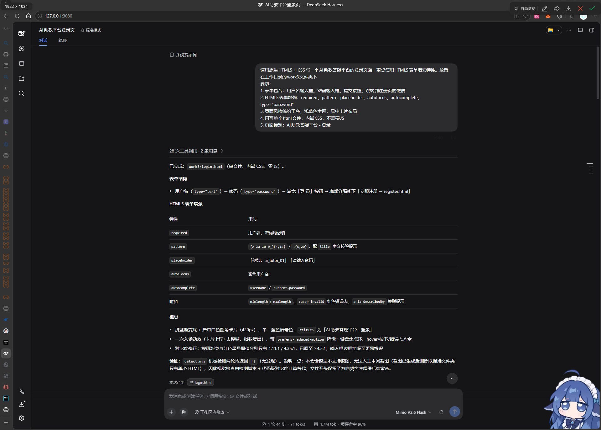
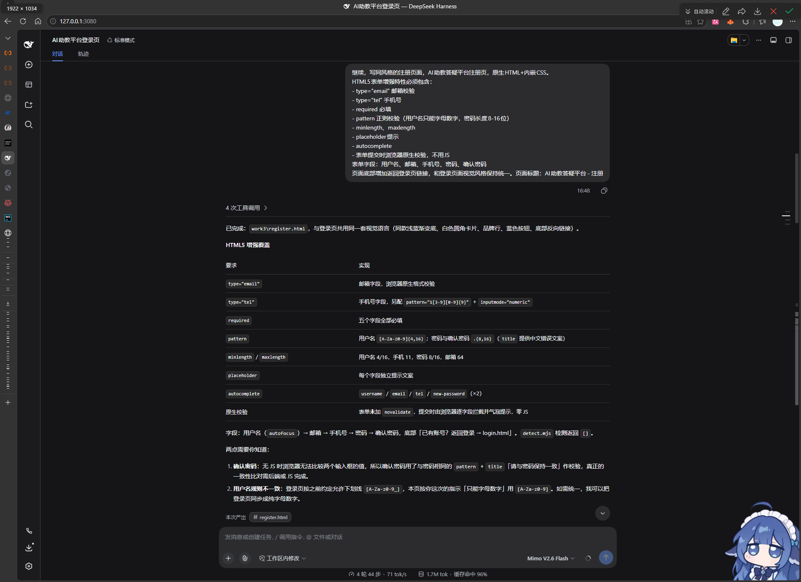
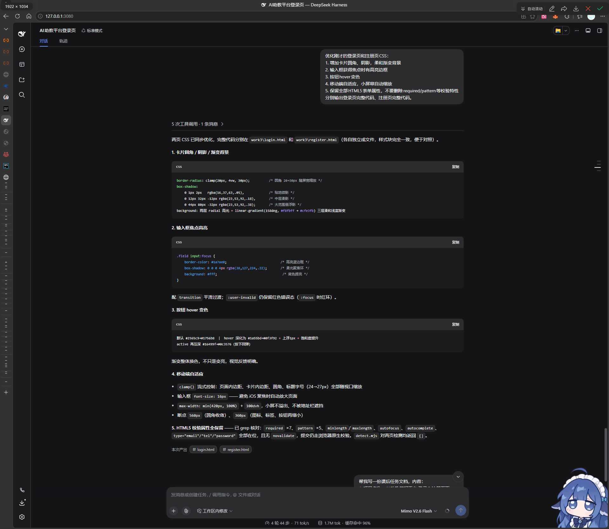

# 课后任务：AI助教答疑平台 登录&注册页面

## 一、项目名称

**项目名称：AI助教答疑平台 登录&注册页面**

- 技术栈：原生 HTML5 + CSS（内嵌样式），全程零 JavaScript
- 页面文件：`login.html`（登录页）、`register.html`（注册页）
- 页面风格：浅蓝色主题，居中卡片布局，移动端自适应

## 二、HTML5 表单增强技术清单

| 技术                      | 作用说明                                                                                                                                                      |
|---------------------------|---------------------------------------------------------------------------------------------------------------------------------------------------------------|
| `required`                | 必填校验。提交时若字段为空，浏览器拦截并提示"请填写此字段"，无需自写判断代码。                                                                                |
| `pattern`                 | 正则校验。用户名 `[A-Za-z0-9]{4,16}`（仅字母数字、4-16 位）；登录密码 `.{6,20}`；注册密码 `.{8,16}`；手机号 `1[3-9][0-9]{9}`；配合 `title` 给出中文错误提示。 |
| `type="email"`            | 邮箱类型。浏览器自动校验邮箱格式（必须含 @ 和域名），移动端调起带 @ 键的键盘。                                                                                |
| `type="tel"`              | 电话类型。移动端自动调起数字键盘，便于输入手机号。                                                                                                            |
| `type="password"`         | 密码类型。输入内容以圆点掩码显示，防止旁人窥屏。                                                                                                              |
| `minlength` / `maxlength` | 长度上下限校验，如用户名 4-16 位、注册密码 8-16 位、手机号最长 11 位。                                                                                        |
| `placeholder`             | 占位提示文案，说明输入格式示例，输入后自动消失。                                                                                                              |
| `autofocus`               | 页面打开时自动聚焦到第一个输入框（用户名），减少一次点击。                                                                                                    |
| `autocomplete`            | 告知浏览器自动填充规则：`username`、`email`、`tel`、`new-password`（注册）、`current-password`（登录），复用浏览器保存的账号。                                |
| 原生约束验证              | 表单不加 `novalidate`，提交时由浏览器逐字段校验并弹出提示气泡；配合 CSS 伪类 `:user-invalid` 将出错输入框渲染为红色边框。整个过程不依赖任何 JavaScript。      |

## 三、其他 HTML5 能力说明

1. **语义化标签**：`main`、`form`、`label for`、`small aria-describedby`、`button type`，提升可读性与无障碍水平。
2. **内联 SVG**：品牌图标用 `<svg>` 矢量绘制，清晰不糊、无需外部图片资源。
3. **文档元信息**：`meta charset="UTF-8"`、`meta viewport`（响应式必需）、`meta description`、`lang="zh-CN"`。
4. **CSS3 能力**（浏览器原生渲染）：`clamp()` 流式字号与间距（小屏自动缩放）、多层 `linear/radial-gradient` 柔和背景、多层 `box-shadow` 卡片阴影、`:focus-visible` 键盘焦点环、`@keyframes` 入场动画。
5. **无障碍降级**：`prefers-reduced-motion` 媒体查询，系统关闭动效时自动禁用入场动画。
6. **移动端适配**：输入框字号设为 16px，避免 iOS 聚焦时页面自动放大；560px / 360px 两级断点自适应。

## 四、仓库说明

```
work3/
├── login.html              登录页（单文件，内嵌 CSS，无 JS）
├── register.html           注册页（单文件，内嵌 CSS，无 JS）
├── 课后任务文档.md         本文档（可编辑源）
└── 课后任务文档.docx       提交版
```

- 两个页面均为**独立单文件**，双击即可在浏览器打开预览，无需搭建服务器。
- 页面间可互相跳转：登录页底部"立即注册"→ `register.html`；注册页底部"返回登录"→ `login.html`。

## 附：对话截图





